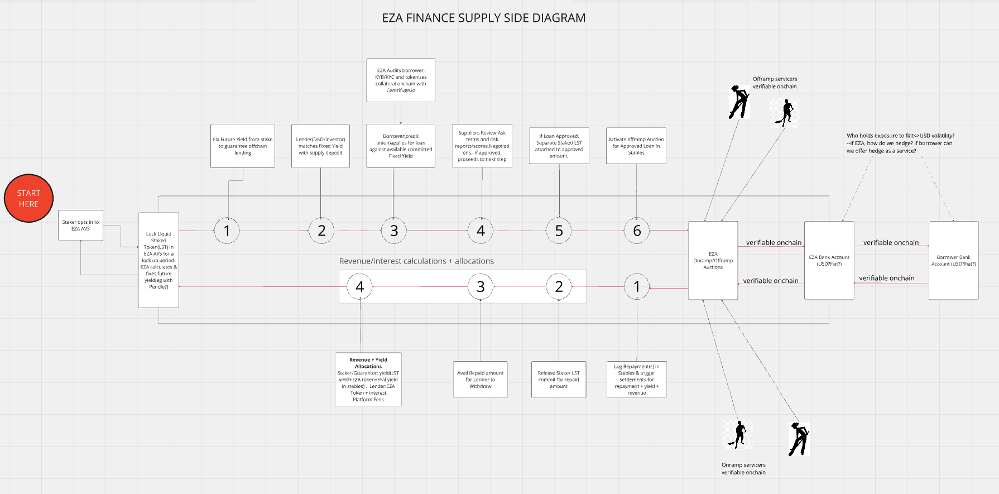

# Eza Finance

Eza.Finance is an enterprise that utilizes Web3 lending platforms to connect decentralized autonomous organizations (DAOs) with local financial institutions in Africa, such as Credit Unions and MFIs. 
The aim is to enable affordable lending to underserved groups like small businesses, women, and youth. By leveraging Web3 technology and settling payments in usable legal tender, Eza.Finance facilitates fast and accessible credit provision while fostering economic growth and development in Africa.
The platform sources funds from DAOs at competitive rates and converts them to local fiat eg. Kenyan shillings (KES). These funds are then onlent to Saccos, MFIs, and other financial institutions, which can use them to offer loans to their members or customers. The platform also facilitates the conversion of repayments back to the original tokens, enabling the return of the principal and interest to the DAOs

### Getting Started
This is a test repository for this project and is based on Express Js with SQLite DB.

### Prerequisites

Before you begin, ensure you have met the following requirements:

- Node.js installed on your local machine.
- yarn package manager installed.
- Basic knowledge of JavaScript and Express.js.

## Installation

1. Clone the repository:
    ```bash
   git clone https://github.com/your-username/eza-finance-demo.git

2. Navigate into the project directory:
    ```bash
    cd eza-finance-demo

3. Install dependencies:
    ```bash
    yarn install
4. Seed DB
    ```bash
    yarn run seed
5. Start the server:
   ```bash
   yarn start


### Dashboards

Open your web browser and go to

1. http://localhost:8000/admin_dashboard to view the Admin dashboard.
2. http://localhost:8000/sacco_dashboard to view the Sacco dashboard.
3. http://localhost:8000/dao_dashboard to view the DAO dashboard.
4. http://localhost:8000/lp_dashboard to view the Liquidity Provider dashboard.


## How it works


Detailed flow can be found here https://miro.com/app/board/uXjVKPflm6I=/?share_link_id=57634080369
## Authors

- [@CollinsMunene](https://github.com/CollinsMunene)

